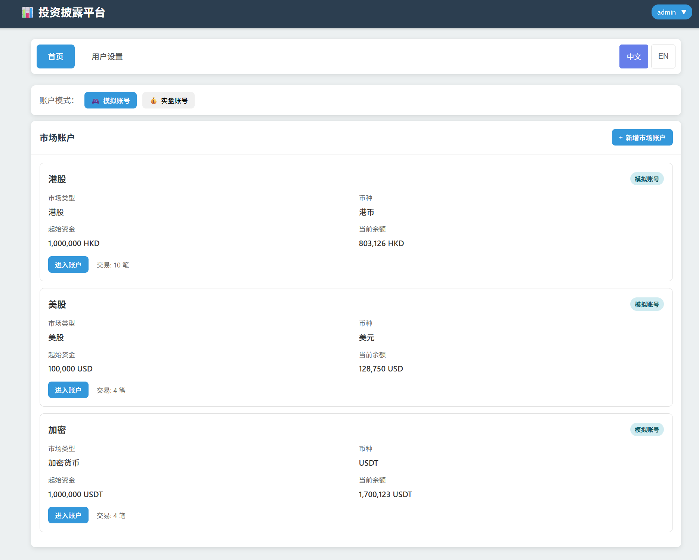
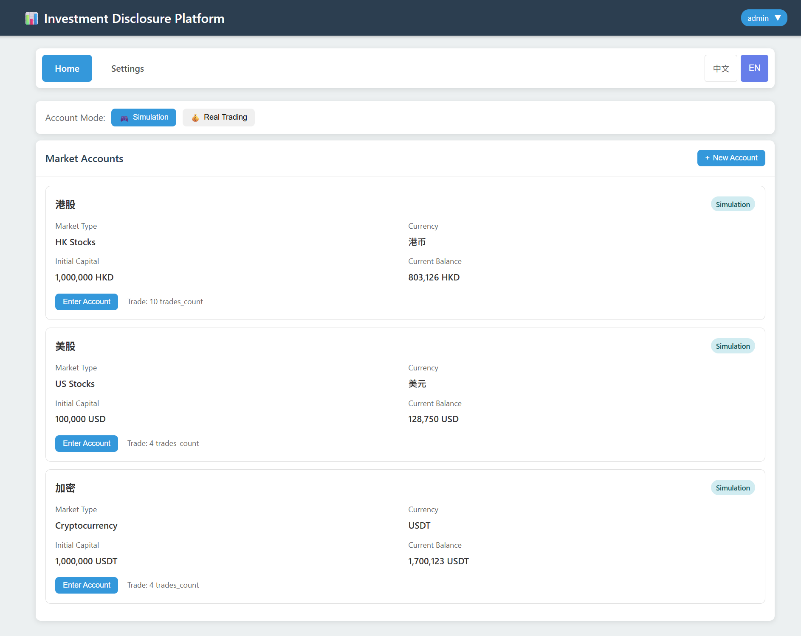

# Stocks-Lab - 投资项目只读披露平台

[](screenshots/CHs.png)
[](screenshots/Eng.png)

**中文** | [English](#stocks-lab---investment-portfolio-disclosure-platform)

这是一个基于 Django + Django REST Framework 的投资项目披露平台，专为投资者设计，提供完整的交易记录管理、盈亏分析、分享导出等功能。采用 Mobile-first 响应式设计，完美适配桌面和移动设备。

## 🌟 主要亮点

- **📊 撮合交易智能识别** - 自动匹配开仓和平仓记录，显示完整交易对信息
- **📸 交易分享功能** - 生成富途风格的交易分享图片，支持自定义布局和二维码
- **📝 交易笔记导出** - 导出详细的交易笔记，包含开仓和平仓的完整信息
- **📱 响应式设计** - 完美适配手机、平板和桌面设备
- **🌐 多语言支持** - 中英文界面切换，满足不同用户需求

## 功能特性

### 核心功能
- **项目管理**：创建和管理多个投资项目
- **成员权限**：基于项目的角色权限控制（ADMIN/VIEWER）
- **出资记录**：记录项目成员的出资信息
- **日结余**：每日手动记录账户余额，支持净值曲线查看
- **交易记录**：详细记录每笔交易，包含理论依据和复盘
- **撮合交易**：智能识别开仓和平仓交易对，显示完整交易信息
- **交易分享**：生成富途风格的交易分享图片，支持自定义布局
- **交易笔记**：导出详细的交易笔记，包含开仓和平仓信息
- **持仓分享**：生成持仓概览分享图，支持二维码集成
- **附件管理**：支持交易和日结余添加图片附件
- **审计日志**：自动记录所有关键操作

### 权限控制
- 资源级权限基于 ProjectMember
- 未加入项目的用户无法访问项目数据（403）
- VIEWER 角色只能查看（GET/HEAD/OPTIONS）
- ADMIN 角色可以进行所有操作（POST/PUT/PATCH/DELETE）
- 附件访问也需要验证项目权限

### 前端特性
- Mobile-first 响应式设计
- 手机底部 Tab 导航
- 大按钮友好操作
- 数字键盘输入
- 卡片式列表展示
- Markdown 支持（交易依据和复盘）

## 快速开始

### 1. 环境要求
- Python 3.8+
- Node.js 16+ 和 npm
- pip

### 2. 初始化项目

```bash
# 进入项目目录
cd ~/Html-Project/Stocks-Lab

# 初始化后端
./manage.sh setup
./manage.sh migrate
./manage.sh admin

# 安装前端依赖
cd frontend && npm install && cd ..

# （可选）生成测试数据
source venv/bin/activate
python create_test_data.py
```

### 3. 启动开发环境

**方式一：统一启动（推荐）**
```bash
./start_dev.sh
```

这会使用 tmux 同时启动前后端服务。

**方式二：分别启动**
```bash
# 终端 1 - 启动后端（端口 20004）
./manage.sh run

# 终端 2 - 启动前端（端口 20003）
cd frontend && npm run dev
```

### 4. 访问系统

- **前端界面**: http://localhost:20003
- **后端管理**: http://localhost:20004/admin
- **API 端点**: http://localhost:20004/api/v1

测试账户（运行 `create_test_data.py` 后）：
- 管理员: `admin` / `admin123`

### 5. 管理员密码修改

**方法一：使用脚本（推荐）**
```bash
# 修改密码
./change_admin_password.sh 新密码

# 示例
./change_admin_password.sh mynewpassword123
```

**方法二：Django命令**
```bash
source venv/bin/activate
python manage.py shell
# 然后执行：
from django.contrib.auth.models import User
admin = User.objects.get(username='admin')
admin.set_password('新密码')
admin.save()
```

详细说明请参考：[ADMIN_PASSWORD_GUIDE.md](ADMIN_PASSWORD_GUIDE.md)

测试账户（运行 `create_test_data.py` 后）：
- 观察者: `viewer` / `viewer123`

### 6. 停止服务

```bash
./stop_dev.sh
```

**详细端口配置说明**: 见 [PORT_CONFIGURATION.md](PORT_CONFIGURATION.md)

## 使用流程

### 创建项目和添加成员

1. 使用管理员账户登录后台：http://localhost:8002/admin
2. 在 "投资项目" 中创建新项目
3. 在 "项目成员" 中添加成员：
   - 选择项目
   - 选择用户
   - 设置角色（ADMIN 或 VIEWER）

### 添加出资记录

1. 进入后台 "出资记录"
2. 点击 "新增出资记录"
3. 填写出资信息：
   - 选择项目
   - 选择出资人
   - 填写金额
   - 填写出资日期

### 使用前端界面

1. 使用普通用户登录前台：http://localhost:8002
2. 在仪表盘选择项目
3. 管理员可以：
   - 添加日结余记录
   - 添加交易记录
   - 查看所有数据
4. 观察者可以：
   - 查看日结余
   - 查看交易记录
   - 查看出资记录

## 端口配置

本项目采用前后端分离架构：

- **前端开发服务器**: http://localhost:20003
- **后端 API 服务器**: http://localhost:20004

详细配置见：[PORT_CONFIGURATION.md](PORT_CONFIGURATION.md)

## API 端点

**Base URL**: `http://localhost:20004/api/v1`

### 认证
- `POST /login/` - 登录（Django session）
- `POST /logout/` - 登出
- `GET /api/v1/me/` - 获取当前用户信息

### 项目
- `GET /api/v1/projects/` - 获取我可见的项目列表
- `POST /api/v1/projects/` - 创建项目（自动成为管理员）
- `GET /api/v1/projects/{id}/` - 获取项目详情
- `GET /api/v1/projects/{id}/members/` - 获取项目成员
- `POST /api/v1/projects/{id}/add_member/` - 添加成员（仅管理员）

### 出资记录
- `GET /api/v1/contributions/` - 获取出资记录列表
- `POST /api/v1/contributions/` - 创建出资记录（仅管理员）
- `GET /api/v1/contributions/{id}/` - 获取出资记录详情

### 日结余
- `GET /api/v1/balances/` - 获取日结余列表
  - 查询参数：`project`, `from_date`, `to_date`
- `POST /api/v1/balances/` - 创建日结余（仅管理员）
- `GET /api/v1/balances/{id}/` - 获取日结余详情
- `PATCH /api/v1/balances/{id}/` - 更新日结余（仅管理员）

### 净值曲线
- `GET /api/v1/balance-summary/?project={id}` - 获取项目净值曲线
  - 返回：`[{date, balance, delta, return_pct}]`

### 交易记录
- `GET /api/v1/trades/` - 获取交易记录列表
  - 查询参数：`project`, `symbol`, `side`, `from_date`, `to_date`
- `POST /api/v1/trades/` - 创建交易记录（仅管理员）
- `GET /api/v1/trades/{id}/` - 获取交易记录详情
- `PATCH /api/v1/trades/{id}/` - 更新交易记录（仅管理员）

### 附件
- `GET /api/v1/attachments/` - 获取附件列表
  - 查询参数：`owner_type`, `owner_id`
- `POST /api/v1/attachments/` - 上传附件（仅管理员）
- `GET /api/v1/attachments/{id}/` - 获取附件详情

### 审计日志
- `GET /api/v1/audit-logs/` - 获取审计日志（只能看到自己的操作）
  - 查询参数：`action`, `model_type`, `model_id`

## 管理命令

```bash
# 统一启动前后端
./start_dev.sh

# 停止所有服务
./stop_dev.sh

# 检查端口状态
./check_ports.sh

# 查看系统状态
./manage.sh status

# 执行数据库迁移
./manage.sh migrate

# 创建管理员
./manage.sh admin

# 启动后端服务器（端口 20004）
./manage.sh run

# 启动前端服务器（端口 20003）
cd frontend && npm run dev

# 进入 Django Shell
./manage.sh shell

# 收集静态文件
./manage.sh static

# 清理缓存文件
./manage.sh clean

# 备份数据库
./manage.sh backup
```

## 项目结构

```
Stocks-Lab/
├── manage.py                 # Django 管理脚本
├── manage.sh                 # 项目管理脚本
├── requirements.txt          # Python 依赖
├── .env.example             # 环境变量示例
├── .gitignore               # Git 忽略文件
├── db.sqlite3               # SQLite 数据库
├── stocks_lab/              # Django 项目配置
│   ├── __init__.py
│   ├── settings.py          # 项目设置
│   ├── urls.py              # 主路由配置
│   ├── wsgi.py
│   └── asgi.py
├── core/                     # 核心应用
│   ├── __init__.py
│   ├── models.py            # 数据模型
│   ├── serializers.py       # DRF 序列化器
│   ├── viewsets.py          # DRF 视图集
│   ├── views.py             # 前端视图
│   ├── permissions.py       # 权限类
│   ├── urls.py              # API 路由
│   ├── admin.py             # 管理后台配置
│   └── apps.py
├── templates/                # 前端模板
│   ├── base.html            # 基础模板
│   ├── login.html           # 登录页
│   ├── dashboard.html       # 仪表盘
│   ├── projects.html        # 项目列表
│   ├── project_detail.html  # 项目详情
│   ├── balances.html        # 日结余
│   ├── trades.html          # 交易记录
│   ├── contributions.html   # 出资记录
│   └── 403.html            # 无权限页面
├── media/                    # 媒体文件（附件存储）
└── static/                   # 静态文件
```

## 技术栈

### 后端
- Django 4.2.9
- Django REST Framework 3.14.0
- django-cors-headers 4.3.1
- django-filter 23.5
- Pillow 10.1.0（图片处理）
- Markdown 3.5.1（Markdown 渲染）

### 前端
- Django Templates
- 原生 JavaScript（Fetch API）
- 响应式 CSS（Mobile-first）

### 数据库
- SQLite3（开发环境）
- 可轻松切换到 PostgreSQL/MySQL

## 开发说明

### 添加新功能

1. 修改 `core/models.py` 添加新模型
2. 运行 `./manage.sh migrate` 创建数据库表
3. 在 `core/serializers.py` 添加序列化器
4. 在 `core/viewsets.py` 添加视图集
5. 在 `core/urls.py` 注册路由
6. 在 `core/admin.py` 注册管理后台

### 自定义权限

在 `core/permissions.py` 中继承 `BasePermission` 类，实现自定义权限逻辑。

### 添加审计日志

使用 `create_audit_log()` 函数记录操作：

```python
from core.viewsets import create_audit_log

create_audit_log(
    action='CREATE',  # CREATE/UPDATE/DELETE
    model_type='YourModel',
    model_id=obj.id,
    user=request.user,
    changes={'field': 'value'}
)
```

## 生产部署建议

1. **更改 SECRET_KEY**：生成新的密钥并设置到 `.env`
2. **关闭 DEBUG**：设置 `DEBUG=False`
3. **配置 ALLOWED_HOSTS**：添加您的域名
4. **使用 PostgreSQL**：替换 SQLite 数据库
5. **配置 S3**：将附件存储迁移到 S3
6. **使用 Nginx + Gunicorn**：生产环境 Web 服务器
7. **启用 HTTPS**：配置 SSL 证书
8. **收集静态文件**：运行 `./manage.sh static`

## 常见问题

### Q: 如何重置密码？
A: 使用管理后台或 Django Shell：
```python
from django.contrib.auth.models import User
user = User.objects.get(username='用户名')
user.set_password('新密码')
user.save()
```

### Q: 如何备份数据？
A: 运行 `./manage.sh backup` 自动备份 SQLite 数据库。

### Q: 如何切换到 PostgreSQL？
A: 修改 `stocks_lab/settings.py` 中的 `DATABASES` 配置。

### Q: 附件上传失败？
A: 检查 `media/` 目录权限，确保 Django 进程有写入权限。

## 许可证

本项目仅供学习和个人使用。

## 联系方式

如有问题或建议，请联系项目维护者。

---

**注意**：这是一个披露平台，不是交易系统，不接入券商 API。所有数据均为手动录入。

---

# Stocks-Lab - Investment Portfolio Disclosure Platform

[](screenshots/CHs.png)
[](screenshots/Eng.png)

[中文](#stocks-lab---投资项目只读披露平台) | **English**

An investment portfolio disclosure platform based on Django + Django REST Framework, specifically designed for investors to manage trading records, analyze profits/losses, and export/share trading information. Features mobile-first responsive design that perfectly adapts to desktop and mobile devices. **Now with full internationalization support (Chinese/English).**

## 🌟 Key Highlights

- **📊 Smart Trade Matching** - Automatically matches opening and closing trades, displaying complete trade pair information
- **📸 Trade Sharing Feature** - Generate Futu-style trading share images with customizable layouts and QR codes
- **📝 Trade Note Export** - Export detailed trading notes with complete opening and closing information
- **📱 Responsive Design** - Perfect adaptation for mobile, tablet, and desktop devices
- **🌐 Internationalization** - Full Chinese/English UI with language switcher

## Features

### Core Features
- **Market Accounts Management**: Create and manage multiple market accounts (US stocks, HK stocks, crypto)
- **Role-Based Permissions**: Project-level access control (ADMIN/VIEWER)
- **Trade Records**: Detailed logging of every trade with analysis and notes
- **Position Tracking**: Real-time position monitoring with P&L calculation
- **Order Management**: Pending orders with status tracking (PENDING/FILLED/CANCELLED)
- **Cash Adjustments**: Track deposits, withdrawals, fees, and interest
- **Matched Trades**: Intelligent identification of opening/closing trade pairs
- **Trade Sharing**: Generate Futu-style trading share images with custom layouts
- **Trade Notes Export**: Export detailed trading notes with complete information
- **Position Sharing**: Generate position overview with QR code integration
- **Attachment Support**: Add images to trades and daily balances
- **Audit Logs**: Automatic logging of all key operations
- **🌐 Internationalization**: Full Chinese/English UI with language switcher

### Permission Control
- Resource-level permissions based on ProjectMember
- Users without project access receive 403 errors
- VIEWER role: read-only access (GET/HEAD/OPTIONS)
- ADMIN role: full access (POST/PUT/PATCH/DELETE)
- Attachment access requires project verification

### Frontend Features
- Mobile-first responsive design
- Bottom tab navigation for mobile
- Large touch-friendly buttons
- Numeric keyboard support
- Card-based list display
- Markdown support (trade analysis)
- **Language switcher** in navigation bar
- **Real-time translation** for all UI elements

## Quick Start

### 1. Requirements
- Python 3.8+
- Node.js 16+ and npm
- pip

### 2. Initialize Project

```bash
# Navigate to project directory
cd ~/Html-Project/Stocks-Lab

# Initialize backend
./manage.sh setup
./manage.sh migrate
./manage.sh admin

# Install frontend dependencies
cd frontend && npm install && cd ..

# (Optional) Generate test data
source venv/bin/activate
python create_test_data.py
```

### 3. Start Development Environment

**Option 1: Unified Start (Recommended)**
```bash
./start_dev.sh
```

This uses tmux to start both frontend and backend services.

**Option 2: Separate Start**
```bash
# Terminal 1 - Start backend (port 20004)
./manage.sh run

# Terminal 2 - Start frontend (port 20003)
cd frontend && npm run dev
```

### 4. Access System

- **Frontend**: http://localhost:20003
- **Admin Panel**: http://localhost:20004/admin
- **API Endpoints**: http://localhost:20004/api/v1

Test accounts (after running `create_test_data.py`):
- Admin: `admin` / `admin123`
- Viewer: `viewer` / `viewer123`

### 5. Stop Services

```bash
./stop_dev.sh
```

**Detailed Port Configuration**: See [PORT_CONFIGURATION.md](PORT_CONFIGURATION.md)

## Internationalization (i18n)

### Switching Languages

1. Click the language switcher in the navigation bar (CN/EN buttons)
2. Language preference is saved in browser localStorage
3. All pages update automatically on language change

### Supported Pages
- ✅ Login page
- ✅ Account list
- ✅ Account details (including modals)
- ✅ Add security form
- ✅ Add trade form
- ✅ Cash adjustment modal
- ✅ Delete confirmation dialogs

### Translation System
- **File**: `/static/js/i18n.js`
- **200+ translation keys** covering all UI elements
- **Client-side translation** for instant language switching
- **Persistent language selection** across sessions

## Usage Workflow

### Create Projects and Add Members

1. Login to admin panel: http://localhost:8002/admin
2. Create new project in "Investment Projects"
3. Add members in "Project Members":
   - Select project
   - Select user
   - Set role (ADMIN or VIEWER)

### Add Contribution Records

1. Navigate to admin "Contribution Records"
2. Click "Add contribution record"
3. Fill in contribution details:
   - Select project
   - Select contributor
   - Enter amount
   - Set contribution date

### Using Frontend Interface

1. Login to frontend: http://localhost:8002
2. Select project from dashboard
3. Admins can:
   - Add daily balance records
   - Add trade records
   - View all data
4. Viewers can:
   - View daily balances
   - View trade records
   - View contribution records

## API Endpoints

**Base URL**: `http://localhost:20004/api/v1`

### Authentication
- `POST /login/` - Login (Django session)
- `POST /logout/` - Logout
- `GET /api/v1/me/` - Get current user info

### Market Accounts
- `GET /api/v1/accounts/` - List market accounts
- `POST /api/v1/accounts/` - Create account (auto-assigned as admin)
- `GET /api/v1/accounts/{id}/` - Get account details
- `GET /api/v1/accounts/{id}/trades/` - Get account trades
- `GET /api/v1/accounts/{id}/positions/` - Get account positions

### Securities
- `GET /api/v1/securities/` - List securities
- `POST /api/v1/securities/` - Create security (admin only)
- `GET /api/v1/securities/{id}/` - Get security details

### Trades
- `GET /api/v1/trades/` - List trades
  - Query params: `account`, `security`, `action`, `status`, `from_date`, `to_date`
- `POST /api/v1/trades/` - Create trade (admin only)
- `GET /api/v1/trades/{id}/` - Get trade details
- `PATCH /api/v1/trades/{id}/` - Update trade (admin only)
- `POST /api/v1/trades/{id}/confirm_fill/` - Confirm pending order
- `POST /api/v1/trades/{id}/cancel/` - Cancel pending order

### Positions
- `GET /api/v1/positions/` - List positions
- `GET /api/v1/positions/{id}/` - Get position details
- `POST /api/v1/positions/{id}/close/` - Close position

### Audit Logs
- `GET /api/v1/audit-logs/` - Get audit logs (own operations only)
  - Query params: `action`, `model_type`, `model_id`

## Management Commands

```bash
# Start frontend and backend together
./start_dev.sh

# Stop all services
./stop_dev.sh

# Check port status
./check_ports.sh

# View system status
./manage.sh status

# Run database migrations
./manage.sh migrate

# Create admin user
./manage.sh admin

# Start backend server (port 20004)
./manage.sh run

# Start frontend server (port 20003)
cd frontend && npm run dev

# Enter Django Shell
./manage.sh shell

# Collect static files
./manage.sh static

# Clean cache files
./manage.sh clean

# Backup database
./manage.sh backup
```

## Project Structure

```
Stocks-Lab/
├── manage.py                 # Django management script
├── manage.sh                 # Project management script
├── requirements.txt          # Python dependencies
├── .env.example             # Environment variables example
├── .gitignore               # Git ignore file
├── db.sqlite3               # SQLite database
├── stocks_lab/              # Django project config
│   ├── settings.py          # Project settings
│   ├── urls.py              # Main URL configuration
│   └── ...
├── core/                     # Core application
│   ├── models.py            # Data models
│   ├── serializers.py       # DRF serializers
│   ├── viewsets.py          # DRF viewsets
│   ├── views.py             # Frontend views
│   ├── permissions.py       # Permission classes
│   └── ...
├── templates/                # Frontend templates
│   ├── base_new.html        # Base template
│   ├── login_new.html       # Login page
│   ├── accounts_list.html   # Account list
│   ├── account_detail.html  # Account details
│   ├── security_form.html   # Add security form
│   ├── trade_form.html      # Add trade form
│   └── ...
├── static/                   # Static files
│   └── js/
│       └── i18n.js          # Internationalization translations
└── media/                    # Media files (attachment storage)
```

## Technology Stack

### Backend
- Django 4.2.9
- Django REST Framework 3.14.0
- django-cors-headers 4.3.1
- django-filter 23.5
- Pillow 10.1.0 (image processing)
- Markdown 3.5.1 (markdown rendering)

### Frontend
- Django Templates
- Vanilla JavaScript (Fetch API)
- Responsive CSS (Mobile-first)
- **Client-side i18n** with localStorage persistence

### Database
- SQLite3 (development)
- Easy migration to PostgreSQL/MySQL

## Development Guide

### Adding New Features

1. Modify `core/models.py` to add new models
2. Run `./manage.sh migrate` to create database tables
3. Add serializers in `core/serializers.py`
4. Add viewsets in `core/viewsets.py`
5. Register routes in `core/urls.py`
6. Register admin interface in `core/admin.py`

### Adding Translations

Edit `/static/js/i18n.js`:

```javascript
const translations = {
    'zh-hans': {
        'your_key': '中文文本',
        // ...
    },
    'en': {
        'your_key': 'English text',
        // ...
    }
};
```

In HTML template:
```html
<span id="your-element">中文文本</span>

<script>
document.getElementById('your-element').textContent = t('your_key');
</script>
```

### Custom Permissions

Inherit `BasePermission` class in `core/permissions.py`:

```python
from rest_framework.permissions import BasePermission

class CustomPermission(BasePermission):
    def has_permission(self, request, view):
        # Your logic here
        return True
```

## Production Deployment

1. **Change SECRET_KEY**: Generate new key and set in `.env`
2. **Disable DEBUG**: Set `DEBUG=False`
3. **Configure ALLOWED_HOSTS**: Add your domain
4. **Use PostgreSQL**: Replace SQLite database
5. **Configure S3**: Migrate attachments to S3
6. **Use Nginx + Gunicorn**: Production web server
7. **Enable HTTPS**: Configure SSL certificate
8. **Collect static files**: Run `./manage.sh static`

## FAQ

### Q: How to reset password?
A: Use admin panel or Django Shell:
```python
from django.contrib.auth.models import User
user = User.objects.get(username='username')
user.set_password('new_password')
user.save()
```

### Q: How to backup data?
A: Run `./manage.sh backup` to automatically backup SQLite database.

### Q: How to switch to PostgreSQL?
A: Modify `DATABASES` config in `stocks_lab/settings.py`.

### Q: Attachment upload failed?
A: Check `media/` directory permissions, ensure Django process has write access.

### Q: How to add more languages?
A: Edit `static/js/i18n.js` and add new language entries to the `translations` object.

## License

This project is for educational and personal use only.

## Contact

For questions or suggestions, please contact the project maintainer.

---

**Note**: This is a disclosure platform, not a trading system. It does not connect to broker APIs. All data is manually entered.
